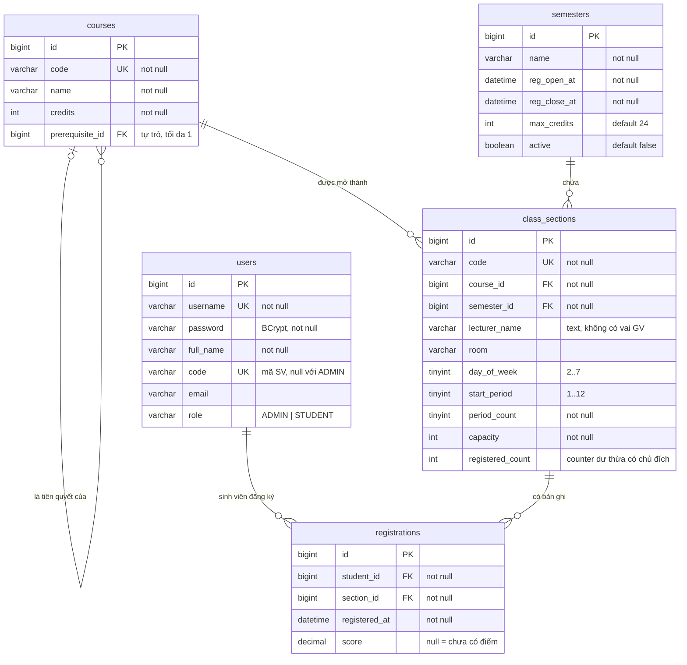
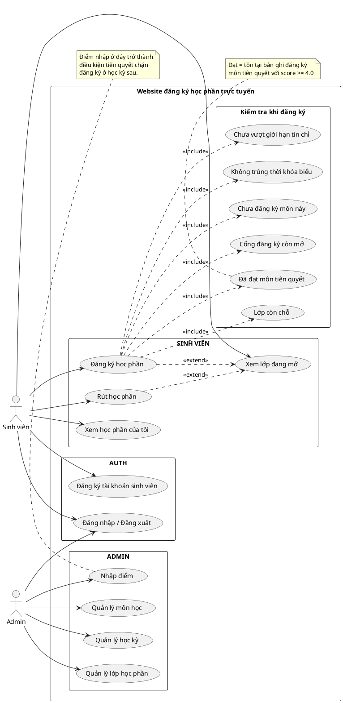
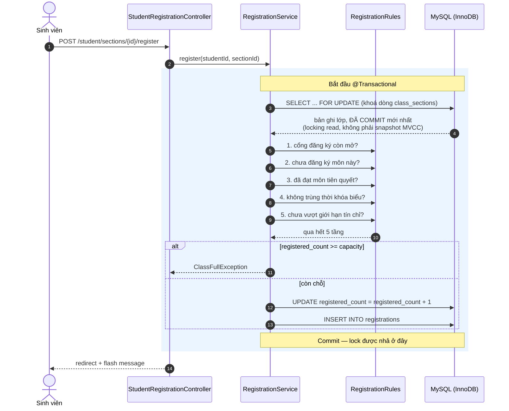

# Sơ đồ cho báo cáo

Ba sơ đồ dưới đây sinh trực tiếp từ code đang chạy, không phải vẽ tay:
ERD lấy đúng theo `src/main/resources/db/migration/V1__schema.sql`, use case theo mục 5
của `DOAN.md`, sequence theo `RegistrationService.register()`.

**Cách xuất ảnh để dán vào báo cáo**

- Mermaid (ERD, sequence): GitHub render sẵn khi xem file này. Trong VS Code dùng
  extension *Markdown Preview Mermaid Support*. Muốn ảnh PNG/SVG thì dán vào
  [mermaid.live](https://mermaid.live) rồi Export.
- PlantUML (use case): dán vào [plantuml.com/plantuml](https://www.plantuml.com/plantuml)
  hoặc dùng extension *PlantUML* trong VS Code.

Nếu sau này sửa schema thì sửa cả file này — sơ đồ lệch với code còn tệ hơn không có sơ đồ.

---

## 1. ERD — đúng 5 bảng

### Ràng buộc không vẽ được trên ERD

Ba thứ này là phần quan trọng nhất của thiết kế nhưng ký hiệu ERD không diễn tả được,
nên phải nêu bằng lời trong báo cáo.

| Ràng buộc | Bảng | Vai trò |
|---|---|---|
| `CHECK (registered_count <= capacity)` | `class_sections` | Lưới an toàn tầng DB, chặn vượt sĩ số theo chiều tăng |
| `UNIQUE (student_id, section_id)` | `registrations` | Chặn một race condition **khác** với row lock: bấm nút hai lần, F5, mạng lag |
| Không dùng `ON DELETE CASCADE` ở mọi khoá ngoại | tất cả | Xoá dữ liệu sinh viên phải là hành động tường minh trong code |

Hai điểm thiết kế nên nói kèm:

- `registered_count` **dư thừa có chủ đích**. Về lý thuyết tính được bằng
  `count(*)` trên `registrations`, vẫn lưu vì đọc nhanh khi hiển thị hàng trăm lớp và
  vì cần một chỗ cụ thể để gắn `CHECK`. Đánh đổi là phải tự giữ đồng bộ, và đó là lý do
  cả `register()` lẫn `drop()` đều phải chạy trong transaction đã lock dòng.
- **Không có bảng `grades`, không có cột `gpa`.** Điểm là cột `score` trên
  `registrations`; điểm chữ và GPA là dữ liệu dẫn xuất, tính lại mỗi lần hiển thị.

---

## 2. Sơ đồ use case

Ghi chú khi trình bày: `Đăng ký học phần` và `Rút học phần` vẽ tách khỏi
`Xem lớp đang mở` cho rõ nghiệp vụ, nhưng trên giao diện chúng nằm cùng một màn hình
(hai nút trên mỗi dòng của danh sách lớp), đúng như mục 5 mô tả.

Sáu use case trong nhóm *Kiểm tra khi đăng ký* không phải chức năng riêng — chúng là
các bước bắt buộc bên trong `register()`, vẽ ra để thấy vì sao chức năng này là trọng
tâm kỹ thuật của đồ án.

---

## 3. Sequence — `register()` và chỗ đặt lock

Đây là sơ đồ nên đưa vào phần trọng tâm của báo cáo. Điểm cần chỉ vào khi bảo vệ là
**dòng `SELECT ... FOR UPDATE` ở bước 2**: từ đó trở đi không transaction nào khác
đọc-ghi được dòng lớp học phần này cho tới khi transaction hiện tại kết thúc.

Ba câu trả lời sẵn cho câu hỏi có thể bị hỏi từ sơ đồ này:

- **Sao lock trước rồi mới validate, không làm ngược lại?** Làm ngược được và lock sẽ
  giữ ngắn hơn, nhưng phải kiểm tra lại sĩ số lần nữa sau khi lock, tức thêm một vòng
  truy vấn. Nhóm chọn thứ tự này vì dễ đọc và dễ chứng minh đúng; đánh đổi là thời gian
  giữ lock dài hơn mức tối thiểu.
- **Khoá thế thì hệ thống chậm không?** Lock ở mức **dòng**, và khoá đúng dòng lớp học
  phần đang bị tranh chấp. Hai sinh viên đăng ký hai lớp khác nhau không chờ nhau chút
  nào; chỉ người tranh cùng một lớp mới xếp hàng.
- **Trong lúc giữ lock có làm gì chậm không?** Không. Không gửi email, không gọi API
  ngoài, không `Thread.sleep`. Transaction giữ lock phải ngắn.
